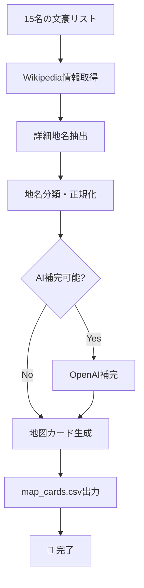

# 🗺️ 日本文豪地図カード生成システム（スリム版）

日本の文豪とゆかりの地を地図カード形式で表示するためのデータ生成システムです。  
Wikipedia情報を自動収集し、地図表示に最適化されたカードデータを生成します。

## ✨ 特徴

- **🎯 地図表示特化**: 地図カード表示のみに最適化されたシンプル設計
- **📍 詳細住所抽出**: 都道府県から具体的施設まで正確な地名抽出
- **🗺️ Maps連携準備**: Google Maps URL自動生成で即座に地図表示可能
- **⚡ 軽量・高速**: 不要な機能を削除した効率的なシステム
- **📊 豊富な地名情報**: 出生地、活動地、記念館など分類された地名データ

## 📋 システム仕様

### 対象文豪（15名厳選）
夏目漱石、芥川龍之介、太宰治、川端康成、三島由紀夫、宮沢賢治、谷崎潤一郎、  
森鴎外、樋口一葉、石川啄木、与謝野晶子、正岡子規、中原中也、志賀直哉、武者小路実篤

### 出力データ形式
**map_cards.csv**（150枚のカードデータ）
- `card_id`: カード識別番号
- `作品名`: 代表作品名
- `作者名`: 文豪名
- `ゆかりの土地`: 地名
- `内容説明`: カード用説明文
- `地名種類`: 出生地/活動地/記念館など
- `Maps_URL`: Google Maps検索URL
- `Maps準備済み`: 地図表示可能状況

### 地名分類
- **出生地**: 生誕の地
- **居住地**: 生活した場所
- **活動地**: 執筆・創作活動の地
- **記念館・文学施設**: 記念館、文学館、博物館
- **墓所**: 墓地・埋葬地
- **作品舞台**: 作品の舞台となった地
- **ゆかりの地**: その他関連地

## 🛠️ セットアップ

### 1. 基本インストール

```bash
# リポジトリクローン
git clone https://github.com/m37335/bungo_project.git
cd bungo_project

# 依存関係インストール
pip install -r requirements.txt
```

### 2. 環境設定（オプション）

#### OpenAI API（AI補完用）
```bash
export OPENAI_API_KEY="your_openai_api_key_here"
```

#### 処理数制限
```bash
export MAX_AUTHORS=15  # デフォルト15名
```

## 🚀 使用方法

### 基本実行
```bash
python bungo_card_collector.py
```

### 出力例
```
🚀 日本文豪地図カード生成システム開始
📚 文豪一覧を取得中...
✅ 地図表示用文豪: 15名

[1/15] 処理中: 夏目漱石
📖 「夏目漱石」のWikipedia情報取得中...

🗺️ 地図カード用データ生成中...
✅ 地図カード生成完了: 150枚
💾 地図カード保存完了: map_cards.csv

🎯 処理完了！
📚 処理文豪数: 15人
🗺️ 生成カード数: 150枚
✅ Maps準備済み: 92枚 (61.3%)
📁 出力ファイル: map_cards.csv
```

## 📊 生成データ統計

- **カード総数**: 150枚
- **対象文豪**: 15人
- **Google Maps準備率**: 61.3%
- **地名種類**: 7カテゴリ
- **即座に地図表示可能**: 92箇所

## 🏗️ システム構成

```
bungo_project/
├── 🗺️ bungo_card_collector.py     # メインシステム（471行）
├── 📊 map_cards.csv              # 出力データ（150枚）
├── 📋 requirements.txt           # 依存関係
├── 📝 env_example.txt            # 環境変数サンプル
├── 📖 README.md                  # このファイル
├── ⚖️ LICENSE                   # MITライセンス
└── 🔍 .gitignore                # Git除外設定
```

## ⚡ 処理フロー



## 🔧 カスタマイズ

### 文豪リスト変更
`bungo_card_collector.py`の`get_authors_list()`メソッド内の`famous_authors`リストを編集

### 地名抽出ルール調整
`extract_works_and_places()`メソッド内のパターンマッチングルールを修正

### カード説明文カスタマイズ
`create_map_cards()`メソッド内の説明文生成ロジックを変更

## 📝 依存関係

```txt
wikipedia
pandas
requests
openai
python-dotenv
```

## 🎯 使用例

### 地図アプリ連携
```python
import pandas as pd

# カードデータ読み込み
df = pd.read_csv('map_cards.csv')

# Maps準備済みのカードのみ取得
ready_cards = df[df['Maps準備済み'] == '○']

# Google Maps URLでブラウザ起動
for _, card in ready_cards.iterrows():
    print(f"{card['作者名']} - {card['ゆかりの土地']}")
    print(f"URL: {card['Maps_URL']}")
```

### データ分析
```python
# 文豪別カード数
author_counts = df['作者名'].value_counts()

# 地名種類別統計
place_types = df['地名種類'].value_counts()

# Maps準備率
maps_ready_rate = len(df[df['Maps準備済み'] == '○']) / len(df) * 100
```

## 🚀 今後の拡張計画

- **📱 Webアプリ**: Streamlitによる地図表示インターフェース
- **🗾 地図可視化**: 実際の地図上へのカードプロット機能
- **🎨 カードデザイン**: 美しいカード画像の自動生成
- **📚 作品情報拡張**: 青空文庫との連携
- **🌍 国際化**: 海外文豪への対応

## 📄 ライセンス

MIT License - 商用・非商用問わず自由に利用可能

## 🤝 コントリビューション

プルリクエスト・イシュー報告歓迎します！  
文豪追加、地名抽出精度向上、新機能提案など

---

**🎉 シンプル・軽量・効果的な文豪地図システムをお楽しみください！** 