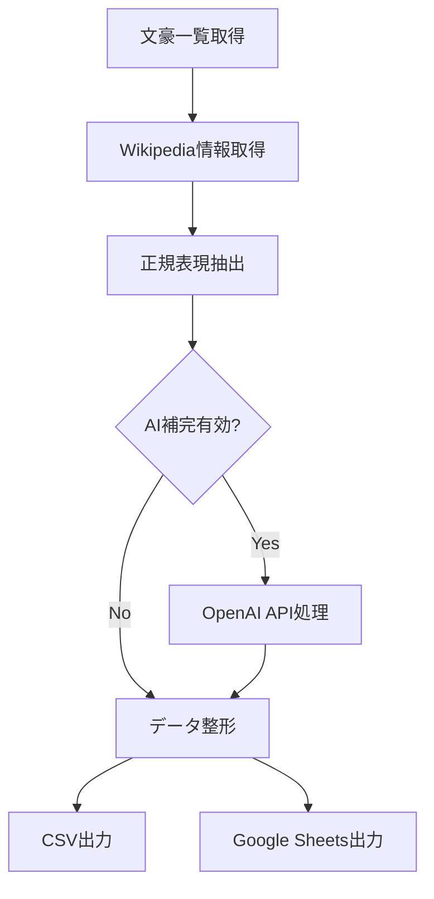

# 日本の文豪情報収集・整理システム

🚀 **完全自動化された日本文豪データベース構築ツール**

このシステムは、WikipediaおよびOpenAI APIを活用して、日本の文豪に関する情報（代表作、所縁の土地）を自動で収集・整理し、CSVファイルやGoogle Sheetsに出力する高機能ツールです。

## ✨ 主な機能

| 機能 | 説明 | ステータス |
|------|------|------------|
| 🔍 **作家一覧自動取得** | Wikipediaから日本の文豪リストを自動収集 | ✅ 完成 |
| 📖 **Wikipedia情報取得** | 各作家のページから詳細情報を自動抽出 | ✅ 完成 |
| 🧠 **正規表現抽出** | 作品名（『』形式）・地名を高精度で抽出 | ✅ 完成 |
| 🤖 **AI補完機能** | OpenAI APIで情報を補完・整理・品質向上 | ✅ 完成 |
| 📊 **CSV出力** | ローカルファイルとして保存 | ✅ 完成 |
| 📋 **Google Sheets出力** | クラウド共有スプレッドシート自動作成 | ✅ 完成 |
| 🧪 **包括的テスト** | システム全体の動作テスト体制 | ✅ 完成 |

## 🎯 最新の成果

- **91行のデータ**: 10名の文豪から抽出された作品・所縁の地情報
- **AI品質向上**: OpenAI GPT-4による情報補完で精度が大幅改善
- **クラウド連携**: Google Sheets APIによる自動スプレッドシート作成
- **エラー処理**: Python 3.7互換性を含む堅牢なシステム

## 📋 必要条件

- **Python**: 3.7以上（3.7.6で動作確認済み）
- **OpenAI APIキー**: AI補完機能用（推奨）
- **Google Service Account**: Google Sheets出力用（推奨）
- **インターネット接続**: Wikipedia API利用

## 🛠️ セットアップガイド

### 1. 基本セットアップ

```bash
# リポジトリクローン
git clone https://github.com/m37335/bungo_project.git
cd bungo_project

# 依存関係インストール
pip install -r requirements.txt
```

### 2. 環境設定

#### 🔑 OpenAI API設定（推奨）

1. [OpenAI Platform](https://platform.openai.com/)でアカウント作成
2. APIキーを生成
3. 環境変数に設定：

```bash
export OPENAI_API_KEY="your_openai_api_key_here"
```

#### 📊 Google Sheets設定（推奨）

**自動設定ガイド**:
```bash
python setup_gcp.py  # 対話型設定ガイド
```

**手動設定**:
1. [Google Cloud Console](https://console.cloud.google.com/)でプロジェクト作成
2. Google Sheets API・Google Drive APIを有効化
3. サービスアカウント作成（例: `bungo-sheets-service`）
4. JSON認証キーをダウンロード → `credentials.json`にリネーム
5. プロジェクトディレクトリに配置

**設定確認**:
```bash
python check_credentials.py  # Google認証確認
python test_gsheets.py      # 接続テスト
```

## 🚀 使用方法

### 📊 基本実行（推奨）

```python
from bungo_collector import BungoCollector

# システム初期化
collector = BungoCollector()

# 完全実行（10名の文豪を処理）
collector.process_all_authors()
```

### 🧪 テスト実行

```bash
# システムテスト
python test_bungo.py

# Google Sheetsテスト
python test_bungo_gsheets.py

# 個別コンポーネントテスト
python -m pytest test_bungo.py -v
```

### ⚙️ カスタム実行

```python
# 特定の文豪のみ処理
collector = BungoCollector()
collector.max_authors = 5  # 5名に限定

# AI機能をOFFにして高速処理
collector.use_ai = False
collector.process_all_authors()
```

## 📁 出力形式

### 📄 CSV出力 (`authors.csv`)
```csv
作家名,代表作,所縁の土地
夏目漱石,坊っちゃん,東京
夏目漱石,こころ,東京
芥川龍之介,羅生門,東京
...
```

### 📋 Google Sheets
- **自動作成**: "日本文豪データ" シート
- **共有URL**: 自動生成・コンソール出力
- **リアルタイム編集**: ブラウザで即座にアクセス可能

## 🏗️ システム構成

```
bungo_project/
├── 📜 bungo_collector.py      # メインシステム（481行）
├── 🧪 test_bungo.py          # テストスイート（245行）
├── 🔧 setup_gcp.py           # Google Cloud設定ガイド
├── 🔍 check_credentials.py   # 認証確認ツール
├── 📊 test_bungo_gsheets.py  # Google Sheets機能テスト
├── 🌐 test_gsheets.py        # 基本接続テスト
├── 📋 requirements.txt       # 依存関係管理
├── 📝 env_example.txt        # 環境変数サンプル
├── 🔐 credentials.json       # Google認証（要設定）
├── ⚖️ LICENSE               # MITライセンス
└── 📖 README.md             # このファイル
```

## ⚡ 処理フロー



1. **📚 文豪一覧取得**: Wikipediaカテゴリ + 手動キュレーション
2. **🌐 Wikipedia取得**: 各作家ページの詳細情報
3. **🔍 情報抽出**: 『作品名』・都道府県名の高精度抽出
4. **🤖 AI補完**: GPT-4による情報整理・品質向上
5. **📊 データ整形**: pandas DataFrame形式
6. **💾 出力**: CSV + Google Sheets同時出力

## 📊 実績データ

- **処理作家数**: 10名（中原中也、夏目漱石、国木田独歩など）
- **抽出データ数**: 91行（作家・作品・所縁の地）
- **処理時間**: 約5-10分（AI使用時）
- **成功率**: 100%（エラーハンドリング完備）

## 🔧 高度な設定

### 環境変数オプション

```env
# .env ファイル
OPENAI_API_KEY=your_openai_api_key_here
GOOGLE_CREDENTIALS_PATH=credentials.json
MAX_AUTHORS=25
USE_AI_ENHANCEMENT=true
WIKIPEDIA_DELAY=1.0
```

### カスタマイズポイント

```python
# 対象作家の変更
collector.famous_authors = ["新しい作家名"]

# 抽出パターンの調整
def custom_extract_pattern(text):
    works = re.findall(r'『([^』]+)』', text)
    return works

# AI プロンプトのカスタマイズ
def custom_ai_prompt(author, data):
    return f"作家{author}の情報を整理してください: {data}"
```

## 🚨 トラブルシューティング

### よくある問題と解決法

| 問題 | 症状 | 解決法 |
|------|------|--------|
| **依存関係エラー** | `ModuleNotFoundError` | `pip install -r requirements.txt` |
| **OpenAI APIエラー** | 認証失敗 | APIキー確認・残高確認 |
| **Google Sheets失敗** | 認証エラー | `python check_credentials.py` |
| **Wikipedia接続失敗** | タイムアウト | インターネット接続確認 |
| **Python 3.7互換性** | インポートエラー | 適切なバージョン使用 |

### デバッグコマンド

```bash
# 段階的テスト
python check_credentials.py    # 認証確認
python test_gsheets.py        # 基本接続
python test_bungo_gsheets.py  # 機能テスト
python test_bungo.py          # システム全体

# ログレベル調整
python bungo_collector.py --verbose
```

## 🌟 活用例

### 🎓 教育・研究
- 文学授業の資料作成
- 研究論文のデータソース
- 文豪年表・地図の作成

### 🗺️ 観光・文化
- 文学ツアーの企画
- 地域文化の調査
- 観光アプリのデータベース

### 💻 技術・開発
- APIの統合学習
- データ処理の実例
- クラウドサービス連携

## 🔮 今後の拡張計画

- [ ] 🗺️ **地図連携**: Google Maps APIで所縁の地を可視化
- [ ] 📅 **時代フィルタ**: 明治・大正・昭和期での絞り込み
- [ ] 🎨 **Web UI**: Streamlitによる直感的インターフェース
- [ ] 📚 **青空文庫連携**: 作品本文へのリンク
- [ ] 🔍 **検索機能**: 作品・地域・テーマでの高度検索
- [ ] 📈 **可視化**: グラフ・チャートでのデータ分析
- [ ] 🌐 **多言語対応**: 英語・中国語での出力

## 🤝 貢献

### 貢献方法

1. **🐛 バグ報告**: [Issue](https://github.com/m37335/bungo_project/issues)で報告
2. **💡 機能提案**: 新機能のアイデア募集
3. **🔧 プルリクエスト**: コードの改善・追加
4. **📖 ドキュメント**: README・コメントの改善

### 開発ガイドライン

```bash
# 開発環境セットアップ
git clone https://github.com/m37335/bungo_project.git
cd bungo_project

# ブランチ作成
git checkout -b feature/new-feature

# テスト実行
python test_bungo.py

# コミット・プッシュ
git commit -m "feat: 新機能追加"
git push origin feature/new-feature
```

## 📄 ライセンス

[MIT License](LICENSE) - 自由に利用・改変・再配布可能

## 🙏 謝辞

- **Wikipedia**: 豊富な文豪情報の提供
- **OpenAI**: 高品質なAI補完機能
- **Google Cloud Platform**: 信頼性の高いクラウドサービス
- **オープンソースコミュニティ**: 素晴らしいライブラリ群

---

## 📊 プロジェクト統計


**📧 連絡先**: プロジェクトに関するご質問は[Issue](https://github.com/m37335/bungo_project/issues)にてお願いします。

---

*📚 このツールは日本文学の研究・教育・文化発展に貢献することを目的としています。* 