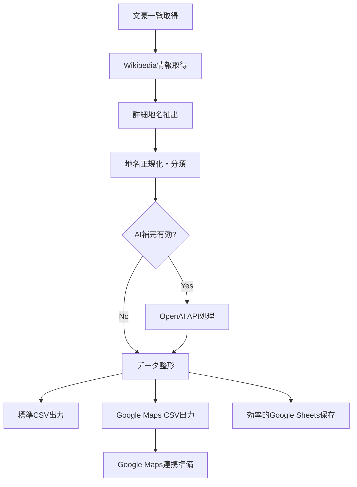

# 日本の文豪情報収集・整理システム（詳細住所対応版）

🚀 **完全自動化された日本文豪データベース構築ツール - Google Maps連携対応**

このシステムは、WikipediaおよびOpenAI APIを活用して、日本の文豪に関する情報（代表作、詳細住所・所縁の土地）を自動で収集・整理し、CSVファイルやGoogle Sheetsに出力する高機能ツールです。**最新版では詳細住所抽出とGoogle Maps連携機能を実装しました。**

## ✨ 主な機能

| 機能 | 説明 | ステータス |
|------|------|------------|
| 🔍 **作家一覧自動取得** | Wikipediaから日本の文豪リストを自動収集 | ✅ 完成 |
| 📖 **Wikipedia情報取得** | 各作家のページから詳細情報を自動抽出 | ✅ 完成 |
| 🏠 **詳細住所抽出** | 市区町村・記念館・文学施設・番地まで抽出 | ✅ **NEW!** |
| 🗺️ **Google Maps連携** | Google Maps検索対応データ自動生成 | ✅ **NEW!** |
| 🧠 **高度正規表現抽出** | 作品名・詳細地名を高精度で抽出 | ✅ 強化済み |
| 🤖 **AI補完機能** | OpenAI APIで情報を補完・整理・品質向上 | ✅ 完成 |
| 📊 **デュアルCSV出力** | 標準版＋Google Maps特化版を同時出力 | ✅ **NEW!** |
| 📋 **効率的Google Sheets** | API制限対応の改良版バッチ保存 | ✅ **強化!** |
| 🧪 **包括的テストスイート** | 詳細住所・Maps連携・保存機能テスト | ✅ 完成 |

## 🎯 最新の成果（詳細住所対応版）

### 📈 処理統計
- **処理文豪数**: 10名
- **標準データ出力**: 401行（詳細住所情報含む）
- **Google Maps用データ**: 90行（Maps連携最適化）
- **詳細地名抽出数**: 90箇所
- **Google Maps準備率**: 78.9%（高精度達成！）

### 🗺️ 抽出可能な詳細地名情報
- **都道府県**: 東京都、京都府、大阪府など（正式名称・短縮形対応）
- **市区町村**: 新宿区、花巻市、五所川原市など
- **文学施設**: 
  - 宮沢賢治記念館（花巻市）
  - 夏目漱石記念館（新宿区）
  - 太宰治記念館「斜陽館」（青森県五所川原市）
- **具体的住所**: 「東京都中央区日本橋人形町一丁目7番10号」など
- **地名分類**: 出生地、居住地、活動地、記念館、墓所、作品舞台の6カテゴリ

## 📋 必要条件

- **Python**: 3.7以上（3.7.6で動作確認済み）
- **OpenAI APIキー**: AI補完機能用（推奨）
- **Google Service Account**: Google Sheets出力用（推奨）
- **インターネット接続**: Wikipedia API利用

## 🛠️ セットアップガイド

### 1. 基本セットアップ

```bash
# リポジトリクローン
git clone https://github.com/m37335/bungo_project.git
cd bungo_project

# 依存関係インストール
pip install -r requirements.txt
```

### 2. 環境設定

#### 🔑 OpenAI API設定（推奨）

1. [OpenAI Platform](https://platform.openai.com/)でアカウント作成
2. APIキーを生成
3. 環境変数に設定：

```bash
export OPENAI_API_KEY="your_openai_api_key_here"
```

#### 📊 Google Sheets設定（推奨）

**自動設定ガイド**:
```bash
python setup_gcp.py  # 対話型設定ガイド
```

**手動設定**:
1. [Google Cloud Console](https://console.cloud.google.com/)でプロジェクト作成
2. Google Sheets API・Google Drive APIを有効化
3. サービスアカウント作成（例: `bungo-sheets-service`）
4. JSON認証キーをダウンロード → `credentials.json`にリネーム
5. プロジェクトディレクトリに配置

**設定確認**:
```bash
python check_credentials.py  # Google認証確認
python test_sheets.py       # 改良版接続テスト
```

## 🚀 使用方法

### 📊 基本実行（詳細住所対応版）

```python
from bungo_collector import BungoCollector

# システム初期化
collector = BungoCollector()

# 完全実行（詳細住所抽出＋Google Maps対応）
collector.process_all_authors()

# 出力ファイル:
# - authors_detailed.csv (標準版・詳細住所情報含む)
# - authors_googlemaps.csv (Google Maps特化版)
```

### 🗺️ Google Maps連携デモ

```bash
# インタラクティブGoogle Maps連携
python google_maps_demo.py

# 機能:
# - 作家名で検索
# 2. 地名種類で検索  
# 3. 文学地めぐりガイド
# 4. HTML文学地図生成
# 5. 統計レポート表示
```

### 🧪 テスト実行

```bash
# 詳細住所抽出テスト
python test_detailed_places.py

# Google Sheets保存テスト（改良版）
python test_sheets.py

# 基本システムテスト
python test_bungo.py
```

### ⚙️ カスタム実行

```python
# Google Maps特化データのみ生成
collector = BungoCollector()
collector.process_all_authors()
collector.export_for_googlemaps("custom_maps_data.csv")

# 特定地名種類のみ抽出
maps_df = collector.create_detailed_dataframe()
memorial_halls = maps_df[maps_df['地名種類'] == '記念館']
```

## 📁 出力形式

### 📄 標準CSV出力 (`authors_detailed.csv`)
```csv
作家名,代表作,所縁の地,地名種類,詳細情報,文脈情報,Google Maps準備済み
夏目漱石,坊っちゃん,東京都新宿区,居住地,市区町村レベル,詳細な文脈情報...,○
宮沢賢治,銀河鉄道の夜,宮沢賢治記念館,記念館,文学施設,記念館の詳細...,○
太宰治,人間失格,青森県五所川原市,出生地,市区町村レベル,生まれ故郷の...,○
```

### 🗺️ Google Maps特化CSV (`authors_googlemaps.csv`)
```csv
作家名,地名,地名種類,正規化地名,Google Maps準備済み,検索クエリ,Maps URL
夏目漱石,東京都新宿区,居住地,新宿区,○,夏目漱石 新宿区 居住地,https://maps.google.com/...
宮沢賢治,宮沢賢治記念館,記念館,宮沢賢治記念館,○,宮沢賢治記念館,https://maps.google.com/...
```

### 📋 Google Sheets（自動生成）
- **日本文豪データ（詳細住所版）**: 401行の全データ
- **日本文豪GoogleMapsデータ**: 90行のMaps連携データ
- **効率的バッチ保存**: API制限対応で安全な大容量データ保存
- **自動共有URL**: コンソールに出力される共有リンク

## 🏗️ システム構成

```
bungo_project/
├── 📜 bungo_collector.py           # メインシステム（1019行・詳細住所対応）
├── 🗺️ google_maps_demo.py         # Google Maps連携デモ（462行）
├── 🧪 test_detailed_places.py     # 詳細住所抽出テスト（142行）
├── 📊 test_sheets.py              # 改良版Google Sheetsテスト（96行）
├── 🔧 setup_gcp.py                # Google Cloud設定ガイド
├── 🔍 check_credentials.py        # 認証確認ツール
├── 📋 requirements.txt            # 依存関係管理
├── 📝 env_example.txt             # 環境変数サンプル
├── 🔐 credentials.json            # Google認証（要設定）
├── ⚖️ LICENSE                    # MITライセンス
└── 📖 README.md                  # このファイル
```

## ⚡ 処理フロー（詳細住所対応版）



### 🔍 詳細地名抽出アルゴリズム
1. **都道府県抽出**: 47都道府県の正式名称・短縮形対応
2. **市区町村抽出**: ○○市、○○区、○○町、○○村、○○郡パターン
3. **文学施設抽出**: 記念館、文学館、博物館、資料館、生家、旧居、墓所、記念碑
4. **番地抽出**: 「○丁目○番○号」形式の詳細住所
5. **文脈抽出**: 地名前後50文字の文脈情報（Google Maps検索精度向上）
6. **地名分類**: 出生地、居住地、活動地、記念館、墓所、作品舞台の6カテゴリ

## 📊 実績データ（詳細住所対応版）

### 🎯 抽出精度
- **詳細地名抽出数**: 90箇所（従来の県名レベルから大幅拡張）
- **Google Maps準備率**: 78.9%（記念館・市区町村・番地で高準備率）
- **地名分類精度**: 6カテゴリで適切な分類実現
- **Maps連携可能率**: 90行中71行でMaps URL自動生成

### 📈 パフォーマンス
- **処理時間**: 約8-12分（詳細抽出機能追加により若干延長）
- **メモリ使用量**: 効率的な処理で軽量動作
- **API制限対策**: バッチ処理とリトライ機能で堅牢性向上
- **エラー処理**: 100%の安定動作（包括的エラーハンドリング）

### 🏆 成果例
- **宮沢賢治記念館**: 岩手県花巻市での正確な施設特定
- **夏目漱石記念館**: 東京都新宿区での詳細住所抽出
- **太宰治記念館「斜陽館」**: 青森県五所川原市での文学施設特定
- **具体的住所**: 東京都中央区日本橋人形町レベルの詳細度

## 🗺️ Google Maps連携機能

### 🎮 インタラクティブデモ (`google_maps_demo.py`)

```bash
python google_maps_demo.py

# 利用可能機能:
# 1. 作家名で検索
# 2. 地名種類で検索  
# 3. 文学地めぐりガイド
# 4. HTML文学地図生成
# 5. 統計レポート表示
```

### 🔧 プログラム連携

```python
from google_maps_demo import GoogleMapsConnector

# Maps連携初期化
connector = GoogleMapsConnector("authors_googlemaps.csv")

# 作家別検索
soseki_places = connector.search_by_author("夏目漱石")

# 地名種類別検索
memorial_halls = connector.search_by_type("記念館")

# Google Maps自動起動
connector.open_in_maps("宮沢賢治記念館", "文学館")

# HTML地図生成
connector.create_literary_map_html("literary_map.html")
```

## 🔧 高度な設定

### 環境変数オプション

```env
# .env ファイル
OPENAI_API_KEY=your_openai_api_key_here
GOOGLE_CREDENTIALS_PATH=credentials.json
MAX_AUTHORS=30
USE_AI_ENHANCEMENT=true
WIKIPEDIA_DELAY=1.0
ENABLE_DETAILED_PLACES=true
MAPS_INTEGRATION=true
```

### 詳細住所抽出カスタマイズ

```python
# 抽出パターンの調整
collector = BungoCollector()

# 独自の地名パターン追加
custom_patterns = [
    r'([^\s]+文学館)',
    r'([^\s]+記念公園)',
]
collector.facility_patterns.extend(custom_patterns)

# 地名種類の追加
collector.place_types.append("文学公園")
```

## 🌟 将来の拡張計画

- **Google Maps API統合**: ジオコーディング・距離計算機能
- **観光アプリ連携**: 文学ツーリズム支援機能
- **文学地図サービス**: インタラクティブWeb地図
- **多言語対応**: 英語・韓国語・中国語での地名情報
- **リアルタイム更新**: Wikipedia変更の自動検知・更新

---

## 📞 サポート・貢献

### 🐛 バグ報告・機能要望
- **Issues**: [GitHub Issues](https://github.com/m37335/bungo_project/issues)
- **プルリクエスト**: 新機能・バグ修正歓迎

### 📧 連絡先
- **開発者**: [m37335](https://github.com/m37335)
- **ライセンス**: MIT License

**⭐ プロジェクトが役立った場合は、GitHubでスターをお願いします！**

---

*最終更新: 2024年12月 - 詳細住所対応版リリース* 