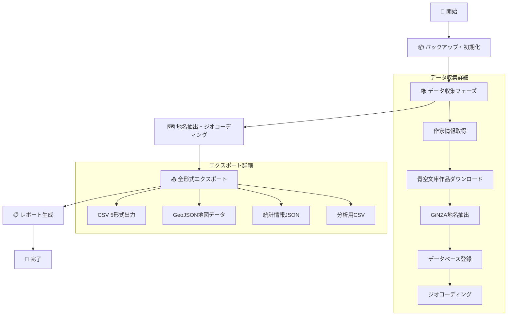

# 文豪ゆかり地図システム - 完全ワークフロー

## 🎯 **一気通貫実行（推奨）**

### **最速実行コマンド**
```bash
# 基本実行（20作家、10作品/作家）
./run_full_pipeline.sh

# カスタム実行
./run_full_pipeline.sh --max-works 15 --verbose

# Python直接実行
python scripts/full_pipeline.py --max-works 20
```

---

## 📊 **システムワークフロー**



---

## 🗂️ **プロジェクト構成とデータフロー**

```
bungo_project/
├── 🔧 scripts/                # 実行スクリプト
│   ├── collect.py              # データ収集
│   ├── bungo_cli.py            # CLI統合インターフェース
│   └── full_pipeline.py        # 一気通貫実行 ⭐
├── 🧠 src/                     # コアシステム
│   ├── core/                   # 中核機能
│   │   ├── db_utils.py         # データベース操作
│   │   ├── aozora_utils.py     # 青空文庫API
│   │   ├── aozora_place_extract.py # GiNZA地名抽出
│   │   └── geocode_utils.py    # ジオコーディング
│   ├── export/                 # データエクスポート
│   │   ├── export_csv.py       # CSV出力
│   │   └── export_geojson.py   # GeoJSON/統計出力
│   ├── api/                    # REST API・GPTサービス
│   └── utils/                  # ユーティリティ
├── 💾 data/                    # データ管理
│   ├── bungo_production.db     # 本番データベース
│   ├── geocode_cache.json      # ジオコーディングキャッシュ
│   ├── output/                 # 出力ファイル ⭐
│   │   ├── bungo_export_*_combined.csv      # 統合CSV
│   │   ├── bungo_production_export_*.geojson # 地図データ
│   │   ├── bungo_stats_*.json               # 統計情報
│   │   └── pipeline_report_*.json           # 実行レポート
│   └── backup_*/               # 自動バックアップ
├── 🏛️ legacy/                 # レガシーアーカイブ
└── 📋 run_full_pipeline.sh     # 一気通貫実行シェル ⭐
```

---

## ⚡ **実行コマンド一覧**

### **1. 一気通貫実行（推奨）**
```bash
# 基本実行
./run_full_pipeline.sh

# カスタム設定
./run_full_pipeline.sh --max-works 15 --verbose
./run_full_pipeline.sh --no-backup

# Python直接実行
python scripts/full_pipeline.py --max-works 20 --verbose
```

### **2. 個別実行**
```bash
# データ収集のみ（全作家）
python scripts/collect.py --all --max-works 10

# 特定作家のみ
python scripts/collect.py --author "夏目漱石" --max-works 5

# CSV エクスポートのみ
python src/export/export_csv.py --type combined

# CLI統合実行
python scripts/bungo_cli.py export --include-stats --include-csv
```

### **3. システム管理**
```bash
# 依存関係インストール
pip install -r requirements.txt

# データベース状況確認
python scripts/bungo_cli.py stats

# 出力ファイル確認
ls -la data/output/

# 統計情報表示
cat data/output/bungo_stats_*.json | python -m json.tool
```

---

## 📈 **パフォーマンス指標**

### **処理規模（デフォルト設定）**
- **対象作家**: 20名
- **最大作品数**: 10作品/作家
- **期待地名数**: 100-300箇所
- **実行時間**: 20-60分

### **出力ファイルサイズ（目安）**
- **統合CSV**: 50-200KB（全データ統合）
- **GeoJSON**: 200-500KB（地図表示用）
- **データベース**: 1-5MB（SQLite）
- **統計JSON**: 1-5KB（メタデータ）

### **スケーラビリティ**
```bash
# 小規模テスト（5作家、3作品/作家）
python scripts/full_pipeline.py --max-works 3
# 実行時間: 5-15分

# 大規模実行（20作家、20作品/作家）
python scripts/full_pipeline.py --max-works 20
# 実行時間: 60-120分
```

---

## 🎛️ **高度な設定**

### **環境変数カスタマイズ**
```bash
# データベースパス変更
export DATABASE_PATH="custom_bungo.db"

# 出力ディレクトリ変更
export OUTPUT_DIR="custom_output/"

# ジオコーディング制限
export MAX_GEOCODE_REQUESTS=500

# OpenAI API（オプション）
export OPENAI_API_KEY="your_api_key"
```

### **設定ファイル編集**
```bash
# 対象作家リスト変更
vim scripts/full_pipeline.py  # MAJOR_AUTHORS編集

# 地名抽出パターン調整
vim src/core/aozora_place_extract.py

# エクスポート形式カスタマイズ
vim src/export/export_csv.py
```

---

## 🚨 **トラブルシューティング**

### **よくある問題**
```bash
# モジュールインポートエラー
export PYTHONPATH=$PWD/src/core:$PWD/src/export:$PWD/src/utils:$PYTHONPATH

# GiNZAモデルエラー
python -m spacy download ja_ginza

# ジオコーディング制限
# → geocode_cache.jsonで結果をキャッシュ済み

# メモリ不足
# → --max-works を小さく設定
```

### **ログ確認**
```bash
# 実行ログ
tail -f full_pipeline_*.log

# エラー詳細
grep "ERROR" full_pipeline_*.log

# 統計確認
cat data/output/pipeline_report_*.json | jq '.pipeline_stats'
```

---

## 🎯 **次のステップ**

### **データ活用**
1. **CSV データ**: Excelやタブローで分析
2. **GeoJSON**: Leaflet.jsやQGISで地図表示
3. **統計情報**: Pythonでデータサイエンス
4. **API連携**: REST APIで他システム連携

### **システム拡張**
1. **作家追加**: scripts/full_pipeline.py のMAJOR_AUTHORS編集
2. **新しい出力形式**: src/export/ に新モジュール追加
3. **地名抽出改善**: src/core/aozora_place_extract.py 調整
4. **可視化機能**: Webアプリケーション開発 